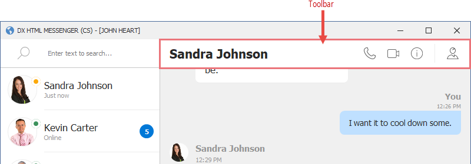
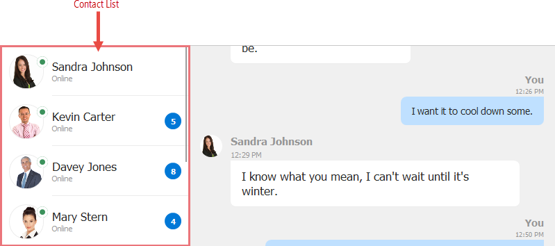
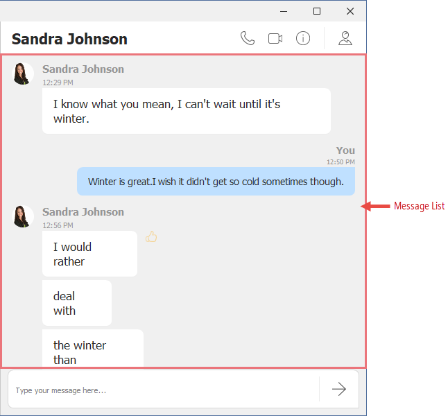
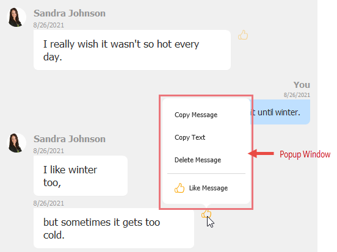

# Application UI Design

### Search Panel


The Search Panel is implemented by the [HtmlContentControl](https://docs.devexpress.com/WindowsForms/DevExpress.XtraEditors.HtmlContentControl). It uses HTML markup and CSS from the following files to render an icon and input box ([SearchControl](https://docs.devexpress.com/WindowsForms/DevExpress.XtraEditors.SearchControl)). 

- [Assets/Html/searchPanel.html](../Assets/Html/searchPanel.html)
- [Assets/CSS/searchPanel.css](../Assets/CSS/searchPanel.css)

The HTML code from the [searchPanel.html](../Assets/Html/searchPanel.html) file is shown below:

```html
<div class='panel'>
    
    <input name="searchControl" class="searchInput">
</div>
```

#### Input Box

Follow the steps below to add an input box to the **HtmlContentControl**:

- Define the `input` tag in HTML markup.
- Place any text editor (the **SearchControl** in this example) onto the **HtmlContentControl**. Set the text editor's name ("searchControl" in this example).
- Set the `name` property of the `input` tag to the name of the created text editor ("searchControl").

The **SearchControl** automatically filters its client control (**SeachControl.Client**) according to the entered text. In this example, the **SearchControl**'s client is the **GridControl** that displays contacts.

### Typing Box


The Typing Box is implemented by the **HtmlContentControl**. It uses HTML markup and CSS from the following files to display an input box ([MemoEdit](https://docs.devexpress.com/WindowsForms/DevExpress.XtraEditors.MemoEdit)) and a _Send_ button. 

- [Assets/Html/typingbox.html](../Assets/Html/typingbox.html)
- [Assets/CSS/typingbox.css](../Assets/CSS/typingbox.css)

The HTML code from the [typingbox.html](../Assets/Html/typingbox.html) file is shown below:

```html
<div class='typingBox'>
    <div class='container'>
        <input name="messageEdit" class="message" />
        <div class='separator-Container'></div>
        
    </div>
</div>
```
#### Input Box
You can add an input box to the **HtmlContentControl** the same way as the Search Panel.

#### Buttons
Follow the steps below to render a button:
- Define an HTML element that renders the button (the `img` tag in this example). Specify the element's class (`button` in this example).
- In the corresponding CSS file, define the `button` class to specify the element's display properties.
- You should also define the `hover` state for the `button` class to highlight the element when it's hovered over.

The following snippet from the [typingbox.css](../Assets/CSS/typingbox.css) file demonstrates this approach:


```css
.button {
	width: 20px;
	height: 20px;
	min-width: 20px;
	padding: 8px;
	margin-left: 2px;
	opacity: 0.5;
}
	.button:hover {
		border-radius: 4px;
		background-color: #F2F2F2;
	}
```

You can handle the [HtmlContentControl.ElementMouseClick](https://docs.devexpress.com/WindowsForms/DevExpress.XtraEditors.HtmlContentControl.ElementMouseClick) event to perform actions when an element (button) is clicked. The current application uses Fluent API to define the button's action on a click.

```cs
fluent.BindCommandToElement(typingBox, "btnSend", x => x.SendMessage);
//...
public void SendMessage() {
    if(Channel != null)
        Channel.Send(new NewMessage(Contact, MessageText));
    MessageText = null;
}
```
```vb
fluent.BindCommandToElement(typingBox, "btnSend", Sub(x) x.SendMessage())
'...
Public Sub SendMessage()
    If Channel IsNot Nothing Then
        Channel.Send(New AddMessage(Contact, MessageText))
    End If
    MessageText = Nothing
End Sub
```
### Toolbar



The Toolbar is implemented by the **HtmlContentControl**. It uses HTML markup and CSS from the following files to display a contact name, and render buttons. 

- [Assets/Html/toolbar.html](../Assets/Html/toolbar.html)
- [Assets/CSS/toolbar.css](../Assets/CSS/toolbar.css)

The HTML code from the [toolbar.html](../Assets/Html/toolbar.html) file is shown below:

```html
<div class='toolBar'>
    <div class='contactName'>${UserName}</div>
    <div class='buttonPanel'>
        
        
        
        <div class='separator-Container'>
            <div class='separator'></div>
        </div>
        
    </div>
</div>
```

#### Data Binding - Display Field Values

The example uses the [HtmlContentControl.DataContext](https://docs.devexpress.com/WindowsForms/DevExpress.XtraEditors.HtmlContentControl.DataContext) property to bind the **HtmlContentControl** to the _MessagesViewModel.Contact_ business object—this data context supplies data to the control. 

In the HTML code above, the '$' character at the beginning of the "${UserName}" string specifies that the string that follows is an [interpolated string](https://docs.microsoft.com/en-us/dotnet/csharp/language-reference/tokens/interpolated)—an expression that the control needs to evaluate. The "{_FieldName_}" form is the syntax for data binding and is used to insert a value of the specified field in the output. The "${UserName}" text inserts a value of the _UserName_ field from the data context.

An interpolated string can contain static text, data binding to multiple fields, and field value formatting (see [string interpolation](https://docs.microsoft.com/en-us/dotnet/csharp/language-reference/tokens/interpolated) for more information). The following example adds the 'Welcome' string before the user name:

```html
<h1>$Welcome {UserName}!</h1>
```

#### Buttons
Buttons are added to the **HtmlContentControl** in the same way as described in the Typing Box section.


### Contacts



The contact list is implemented by the GridControl's [TileView](https://docs.devexpress.com/WindowsForms/114728/controls-and-libraries/data-grid/views/tile-view#html-and-css-based-tile-template). Each record (contact) in a **TileView** is a tile—a non-editable box that arranges fields based on a specific template. The **TileView** allows you to set the tile template in two ways:
- In HTML format (as demonstrated in the current application).
- Using the common Table Layout concept (see [Tile View Template](https://docs.devexpress.com/WindowsForms/114728/controls-and-libraries/data-grid/views/tile-view#create-tile-template)).

In this application, HTML markup and CSS from the following files are used to render each tile: 

- [Assets/Html/contact.html](../Assets/Html/contact.html)
- [Assets/CSS/contact.css](../Assets/CSS/contact.css)

The HTML code from the [contact.html](../Assets/Html/contact.html) file is shown below:

```html
<div class="contact">
    <div class="avatar-container">
        
        <div id="statusBadge" class="status" />
    </div>
    <div>
        <div class="container">
            <div class="contact-info">
                <div class="nameAndInfo">
                    <div class="name">${UserName}</div>
                    
                </div>
                <div class="time">${LastOnlineText}</div>
            </div>
            <div id="unreadBadge" class="badge">${UnreadCount}</div>
        </div>
        <div class='border'></div>
    </div>
</div>
```

#### Data Binding - Display Field Values

The "$FieldName" syntax is used to display values of corresponding fields from a bound data source (**GridControl.DataSource**). The same data binding approach is demonstrated in the Toolbar section above.

#### Customize Individual Elements 

The application handles the [TileView.ItemCustomize](https://docs.devexpress.com/WindowsForms/DevExpress.XtraGrid.Views.Tile.TileView.ItemCustomize) event to dynamically control the visibility of tile elements.

```cs
void OnContactItemTemplateCustomize(object sender, TileViewItemCustomizeEventArgs e) {
    var contact = contactsTileView.GetRow(e.RowHandle) as Contact;
    if(contact != null) {
        var statusBadge = e.HtmlElementInfo.FindElementById("statusBadge");
        if(statusBadge != null && !contact.IsInactive)
            statusBadge.Style.SetBackgroundColor("@Green");
        if(!contact.HasUnreadMessages) {
            var unreadBadge = e.HtmlElementInfo.FindElementById("unreadBadge");
            if(unreadBadge != null)
                unreadBadge.Hidden = true;
        }
    }
}                                                                                    
```
```vb
Sub OnContactItemTemplateCustomize(ByVal sender As Object, ByVal e As TileViewItemCustomizeEventArgs) Handles contactsTileView.ItemCustomize
    Dim contact = TryCast(contactsTileView.GetRow(e.RowHandle), Contact)
    If contact IsNot Nothing Then
        Dim statusBadge = e.HtmlElementInfo.FindElementById("statusBadge")
        If statusBadge IsNot Nothing AndAlso (Not contact.IsInactive) Then
            statusBadge.Style.SetBackgroundColor("@Green")
        End If
        If Not contact.HasUnreadMessages Then
            Dim unreadBadge = e.HtmlElementInfo.FindElementById("unreadBadge")
            If unreadBadge IsNot Nothing Then
                unreadBadge.Hidden = True
            End If
        End If
    End If
End Sub
```


### Messages



The message list is implemented by the GridControl's [ItemsView](https://docs.devexpress.com/WindowsForms/DevExpress.XtraGrid.Views.Items.ItemsView) — a View that renders each item (message) based on a specific HTML template. 
Items are arranged vertically in the current application.

You can find the HTML templates and CSS styles applied to items in the following files: 

- [Assets/Html/message.html](../Assets/Html/message.html)
- [Assets/CSS/message.css](../Assets/CSS/message.css)
- [Assets/Html/mymessage.html](../Assets/Html/mymessage.html) (applied to messages written by the current user).
- [Assets/CSS/mymessage.css](../Assets/CSS/mymessage.css) (applied to messages written by the current user).

The HTML code from the [message.html](../Assets/Html/message.html) file is shown below:

```html
<div class='message'>
    
    <div class='container'>
        <div id="name" class='name'>${Owner.UserName}</div>
        <div id="sent" class='sent'>${StatusText}</div>
        <div class="textAndMore">
            <div class='text'>${Text}</div>
            
        </div>
    </div>
</div>
```

#### Data Binding - Display Field Values

In the application, the GridControl's **ItemsView** is bound to the _MessagesViewModel.Messages_ collection.
An element's "${Owner.Avatar}" syntax in HTML markup is used to bind this element to the _Owner.Avatar_ field on the underlying data store. This data binding technique is described in the Toolbar section above. 

#### Use Different Tempates for Different Items

The [ItemsView.QueryItemTemplate](https://docs.devexpress.com/WindowsForms/DevExpress.XtraGrid.Views.Items.ItemsView.QueryItemTemplate) event is handled to assign different templates to messages of the current user and messages of other users.

```cs
void OnQueryItemTemplate(object sender, DevExpress.XtraGrid.Views.Items.QueryItemTemplateEventArgs e) {
    var message = e.Row as DevExpress.DevAV.Chat.Model.Message;
    if(message == null)
        return;
    if(message.IsOwnMessage)
        Styles.MyMessage.Apply(e.Template);
    else
        Styles.Message.Apply(e.Template);
    var fluent = mvvmContext.OfType<MessagesViewModel>();
    fluent.ViewModel.OnMessageRead(message);
}    
```
```vb
Sub OnQueryItemTemplate(ByVal sender As Object, ByVal e As DevExpress.XtraGrid.Views.Items.QueryItemTemplateEventArgs) Handles messagesItemsView.QueryItemTemplate
    Dim message = TryCast(e.Row, DevExpress.DevAV.Chat.Model.Message)
    If message Is Nothing Then
        Return
    End If
    If message.IsOwnMessage Then
        Styles.MyMessage.Apply(e.Template)
    Else
        Styles.Message.Apply(e.Template)
    End If
    Dim fluent = mvvmContext.OfType(Of MessagesViewModel)()
    fluent.ViewModel.OnMessageRead(message)
End Sub   
```

#### Customize Individual Elements 

The application handles the [ItemsView.CustomizeItem](https://docs.devexpress.com/WindowsForms/DevExpress.XtraGrid.Views.Items.ItemsView.CustomizeItem) event to dynamically customize individual elements of items.

```cs
void OnCustomizeItem(object sender, DevExpress.XtraGrid.Views.Items.CustomizeItemArgs e) {
    var message = e.Row as DevExpress.DevAV.Chat.Model.Message;
    if(message == null || message.IsFirstMessageOfBlock)
        return;
    if(!message.IsOwnMessage) {
        var avatar = e.ElementInfo.FindElementById("avatar");
        if(avatar != null)
            avatar.Hidden = true;
    }
    var name = e.ElementInfo.FindElementById("name");
    if(name != null)
        name.Hidden = true;
    if(!message.IsFirstMessageOfReply) {
        var sent = e.ElementInfo.FindElementById("sent");
        if(sent != null)
            sent.Hidden = true;
    }
}
```
```vb
Sub OnCustomizeItem(ByVal sender As Object, ByVal e As DevExpress.XtraGrid.Views.Items.CustomizeItemArgs) Handles messagesItemsView.CustomizeItem
    Dim message = TryCast(e.Row, DevExpress.DevAV.Chat.Model.Message)
    If message Is Nothing OrElse message.IsFirstMessageOfBlock Then
        Return
    End If
    If Not message.IsOwnMessage Then
        Dim avatar = e.ElementInfo.FindElementById("avatar")
        If avatar IsNot Nothing Then
            avatar.Hidden = True
        End If
    End If
    Dim name = e.ElementInfo.FindElementById("name")
    If name IsNot Nothing Then
        name.Hidden = True
    End If
    If Not message.IsFirstMessageOfReply Then
        Dim sent = e.ElementInfo.FindElementById("sent")
        If sent IsNot Nothing Then
            sent.Hidden = True
        End If
    End If
End Sub
```

### Popup Window

The [HtmlContentPopup](https://docs.devexpress.com/WindowsForms/DevExpress.XtraEditors.HtmlContentPopup) control is a pop-up control that renders its contents from HTML markup and CSS styles. The application uses **HtmlContentPopup** controls to create the following pop-up windows:
- Pop-up windows that show information about the current user and the contact that the user chats with.
- A log off window.
- A pop-up menu that is displayed when you click the 'Thumb Up' icon for a message.



HTML markup and CSS styles from the following files are used to render this pop-up menu: 

- [Assets/Html/menu.html](../Assets/Html/menu.html)
- [Assets/CSS/menu.css](../Assets/CSS/menu.css)

The HTML code from the [menu.html](../Assets/Html/menu.html) file is shown below:

```html
<div class="container">
    <div class="shadow">
        <div class="menu">
            <div id="miCopy" class="menuItem">Copy Message</div>
            <div id="miCopyText" class="menuItem">Copy Text</div>
            <div class="separator"></div>
            <div id="miLike" class="menuItem">
                
                <span>Like Message</span>
            </div>
        </div>
    </div>
    
</div>
```

The [HtmlContentPopup.Show](https://docs.devexpress.com/WindowsForms/DevExpress.XtraEditors.HtmlContentPopup.Show(System.Windows.Forms.IWin32Window-System.Drawing.Rectangle)) method is used to display the pop-up window:

```cs
messageMenuPopup.Show(gridControl, menuScreenBounds);
```

The [HtmlContentPopup.Hide](https://docs.devexpress.com/WindowsForms/DevExpress.XtraEditors.HtmlContentPopup.Hide) method allows you to close the pop-up window.

You can handle the [HtmlContentPopup.ElementMouseClick](https://docs.devexpress.com/WindowsForms/DevExpress.XtraEditors.HtmlContentPopup.ElementMouseClick) event to perform actions when a user clicks on an element within the **HtmlContentPopup** control. The current application uses Fluent API to bind actions to the pop-up control's elements:

```cs
fluent.BindCommandToElement(messageMenuPopup, "miLike", x => x.LikeMessage);
fluent.BindCommandToElement(messageMenuPopup, "miCopy", x => x.CopyMessage);
fluent.BindCommandToElement(messageMenuPopup, "miCopyText", x => x.CopyMessageText);
fluent.BindCommandToElement(messageMenuPopup, "miDelete", x => x.DeleteMessage);
```
```vb
fluent.BindCommandToElement(messageMenuPopup, "miLike", Sub(x) x.LikeMessage())
fluent.BindCommandToElement(messageMenuPopup, "miCopy", Sub(x) x.CopyMessage())
fluent.BindCommandToElement(messageMenuPopup, "miCopyText", Sub(x) x.CopyMessageText())
fluent.BindCommandToElement(messageMenuPopup, "miDelete", Sub(x) x.DeleteMessage())
```

## See Also
- [DXHtmlMessenger Demo Overview](../README.md)
- [Work with Data](HowItWorksWithData.md)
